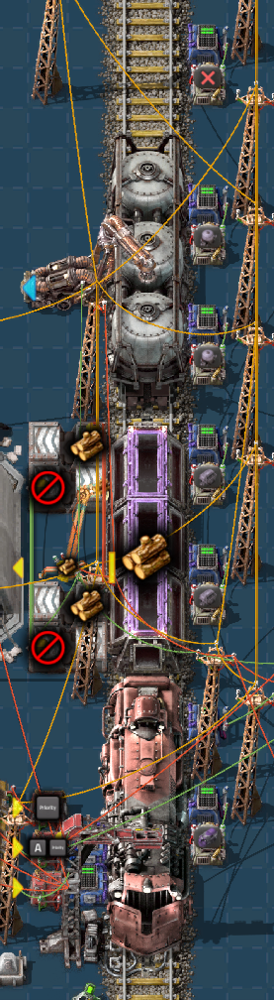

# Presence Mode

The **Presence** combinator mode detects the locomotive or wagon parked in front of the combinator when a train arrives at the station. Use it when your circuit logic needs to treat locomotives, cargo wagons, and fluid wagons differently, or when it needs to know where within the train a given wagon is parked.

## Deploying

Presence is an output mode. Build a combinator so that its yellow box touches one of the rails of a Cybersyn 2 station, then select `Presence` mode. As with the other wagon modes, the combinator reads the rolling stock nearest its yellow box.

When a train arrives at the station, each presence combinator at the stop writes its configured signals for the entity parked in front of it. When the train departs, the outputs of the combinator are cleared.

## Settings

### Item signal

If enabled, the combinator outputs the item signal of the detected entity, such as the locomotive or cargo wagon item. This signal is emitted in addition to any virtual signals configured below.

### Use carriage index as signal value

If enabled, the output value is the index of the detected carriage within the train instead of a flat 1. Locomotives count as carriages, so the value identifies the position of the wagon within the train layout.

:::note
Factorio decides which end of a train that runs in both directions is the front, and the carriage index counts from that end. The same train arriving in the opposite direction has its carriages counted from the other end, so the indexes you read along a station may increase or decrease depending on the orientation Factorio gives the train. An index does not identify the same wagon on both approaches of a bidirectional train.
:::

### Locomotive, cargo wagon, and fluid wagon signals

Select a virtual signal to emit for each type of rolling stock. Only the signal that matches the detected entity is emitted.

### Nothing detected

Select a virtual signal to emit when no rolling stock is parked in front of the combinator.

## Notes

:::note
Detection occurs when a Cybersyn 2 train arrives at the station. The combinator reports a snapshot of what it is pointing at and does not monitor the wagon while the train is parked.
:::

:::tip
Place one presence combinator per wagon slot you want to monitor, in the same manner as the `Wagon Split` and `Wagon Contents` combinators described in [Wagon Control](./wagon-control.md).
:::
