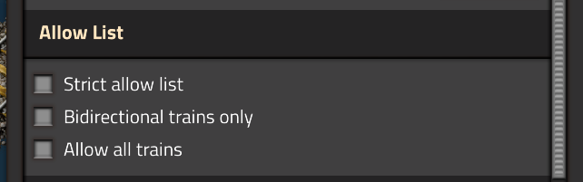
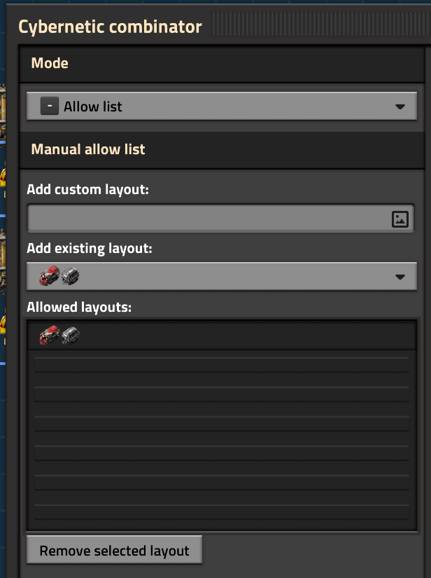

# Allow Lists

A train will only visit a station if the train is on that station's **allow list**. The allow list is a list of train layouts that are permitted to use the station.

## The default allow list

By default, Cybersyn will use an algorithm to attempt to determine what trains can be serviced by your stations. This algorithm takes into account the presence of inserters, pumps, and loaders near the tracks at your station and infers valid train shapes.

This algorithm will allow a train at a station if it can infer that **the station can load or unload each of the train's wagons**.

:::warning

The automatic algorithm does not support:

- Trains with more than 32 carriages.
- Stations with more than 32 carriages worth of loading equipment alongside.
- Loading equipment entities that are not `inserter`, `pump`, `loader`, or `loader-1x1`.

In those cases, another allow list option must be used.

:::

## Changing the behavior of the allow list

The automatic algorithm works for the most common and straightforward logistics setups, but in certain cases, it may not behave the way you want it to. In those cases, you may change the behavior using the following options:

### Automatic algorithm options

Within the `Station` combinator settings you can provide some additional inputs to tweak the behavior of the automatic algorithm:

#### Strict allow list

Strict mode imposes the additional condition that **each station slot with loading equipment must be occupied by a train car**. This means that trains that are "shorter" than the full set of loading equipment will no longer be allowed at the station.

#### Bidirectional trains only

If enabled, trains will only be allowed if they have both forward and reverse locomotives. This can be used for stations that are at the terminus of a rail line.

#### Allow all trains

In some cases you may wish to disable the allow list functionality altogether. By choosing the "allow all trains" option, Cybersyn will route any available train to the station regardless of shape.

:::note

All trains really means all trains. If you need control over which trains arrive but none of the above modes are suitable, you will need to use the Networks feature in addition to the "allow all trains" option.

:::

### Manually allow specific layouts

By placing a combinator in `Allow List` mode you can manually select specific train layouts that can arrive at this stop. You may enter custom layouts or choose from the known layouts of trains that Cybersyn has seen.

The layouts are stored as an exact list of the rolling stock entities that make up the train, making them portable and blueprintable to the extent that trains with the same rolling stock in the same order are present in the destination save.

:::tip

If a layout containing both forward and reverse locomotives is added to the allow list, the reversed direction of the train is implicitly allowed as well. Make sure your bidirectional layouts are symmetrical or that your stations can support reversed trains!

:::

