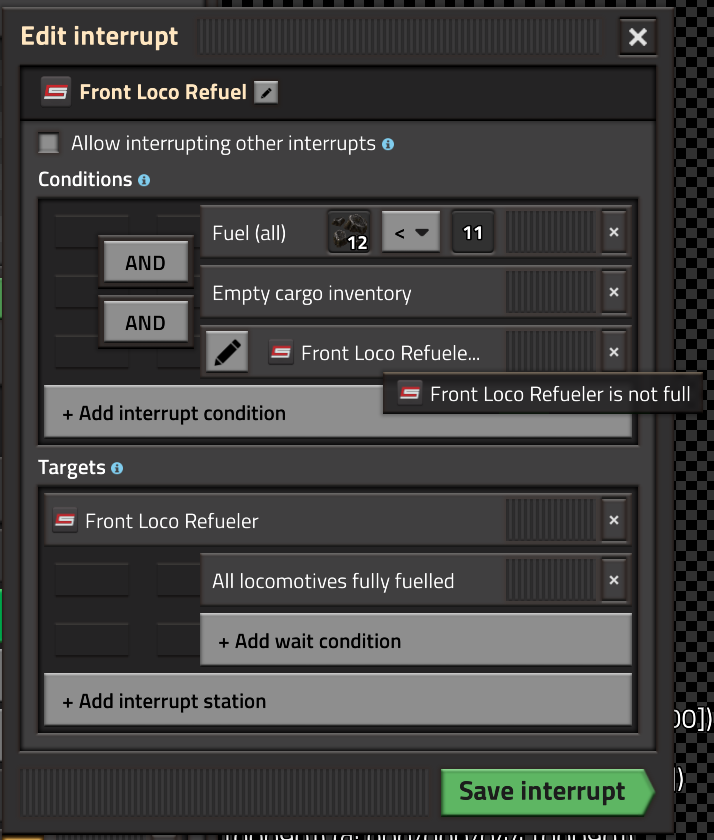

# Trains, Depots, and Interrupts

## Adding Trains

To add a train to Cybersyn, place it in a train group with the  virtual signal icon as the first character in the group name:

:::note
- The  must be the *very first* character in the group name. It may not be preceded by any spaces.

- You may create multiple Cybersyn train groups. The trains don't all have to be in the same group, but they must all begin with .
:::

## Depots

Once added to the train group, the trains will share a common schedule. This schedule **must contain exactly one entry**. That entry will be the train's **depot**. Your group schedule should look like this:

### Depot mechanics

Internally, **Cybersyn is completely unaware of depots** and does not attempt to manage them or route trains between them. Depots are regular train stops that require no special configuration. A depot is simply where a train will go when it has no immediate orders or is waiting in a queue. Cybersyn may issue orders to its trains *at any time*, and will leave them with a *clean schedule* (i.e. only the depot) when it does not have an order for them.

:::warning
The above means that a train must *always* be able to go to a depot when it has no explicit schedule, and that a train must *always* be able to leave its depot when assigned a task. Therefore:

- There must be as many parking slots at a named depot as there are trains assigned to that depot name. This could mean multiple identically named depot stations, multiple stacker slots at the same station, or anything in between, but each train must be able to go somewhere. Generally the total train limit of all same-named depots must equal the number of trains assigned that depot name.

- You cannot stack trains in a single line at depot stations. If using a solution that would otherwise block trains behind the station, like a stacker, there must be an "escape lane" so that if a stacked train is called upon, it is not blocked.
:::

## Interrupts

Cybersyn has nearly full support for Factorio 2.0 train interrupts and their use is recommended when appropriate, particularly for refueling.

### Refueling

Automatic refueling of trains is handled through Factorio interrupts. Simply add an interrupt to the group schedule that sends trains to an appropriate refueler stop when their fuel is low.

:::warning
Correct refueling can be a bit tricky. An **empty cargo inventory** condition stops trains from refueling in the middle of a delivery. A **(refueler) not full** condition prevents trains from clogging consumer stations if refuelers are occupied.
:::

Here is an example refueling interrupt:

### Interrupt Limitations

Due to limitations in the current Factorio API, there is one important restriction on interrupts:

:::danger
An interrupt **MUST NOT** send a train to a Cybersyn station. (A Cybersyn station is one with a **station combinator**. This does not apply to depots/refuelers or any other train stop not in Cybersyn's control.)
:::

This means no combination requester/refuelers, sorry chums.

## Further Notes

### Train Ownership

Cybersyn "owns" its trains. Switching a train to manual, modifying the schedule, changing a train's rolling stock, or any other external change will result in the train being removed from Cybersyn and any deliveries involving that train being aborted. You will then have to re-add the train using the above procedure.

It is possible that certain changes to a train may not be detected properly by Cybersyn. If you intervene with a train schedule or you run a third party mod that does so, you are responsible for any improper behavior.
