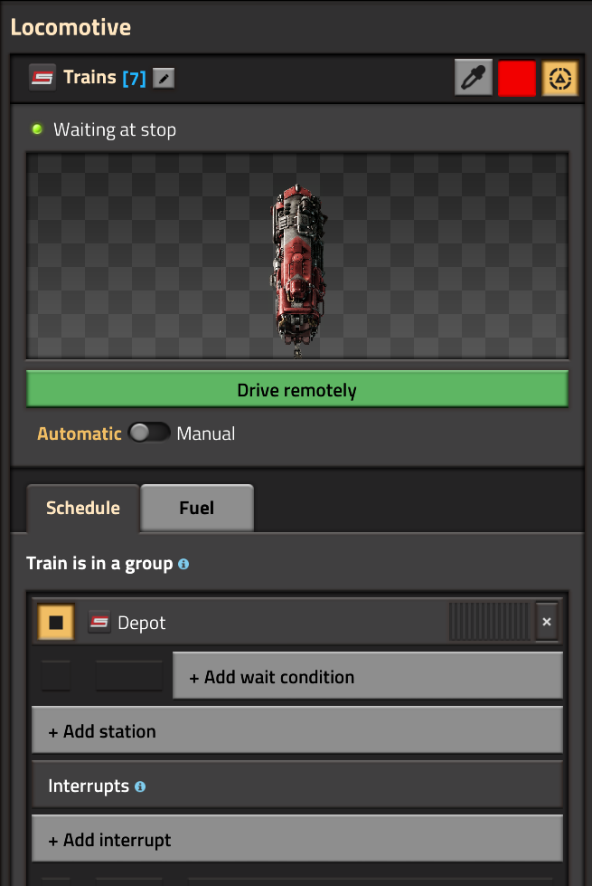

# Introduction

Cybersyn 2 is a Factorio train logistics mod designed for versatility and
performance. It is similar in functionality to the famous Logistics Train Network
mod, but with a much broader scope.

Cybersyn 2 is the direct successor of Project Cybersyn, built and maintained
by the same community. It has been redesigned to take advantage of the new
train functionality available in Factorio 2.0.

## Getting Started

The following is a quick-start guide for a basic provider/requester setup.

### Add a Train

Create a train stop which will serve as the *depot* for your newly created train.
Build a train at the stop and add it to a train group beginning with the  virtual signal. Give
the train group a schedule with only the depot on it and set the train to Automatic.
Your schedule should look like this:

You've now added a train to Cybersyn. You may add further trains by simply assigning
them to the same group.

:::note
See [the Trains documentation](./basics/trains.md) for more information on
configuring Cybersyn trains, including refueling.
:::

### Provider

Make a provider

### Requester

Make a requester

## More

This is only the very tip of the iceberg of what can be done using Cybersyn 2.
Continue reading

