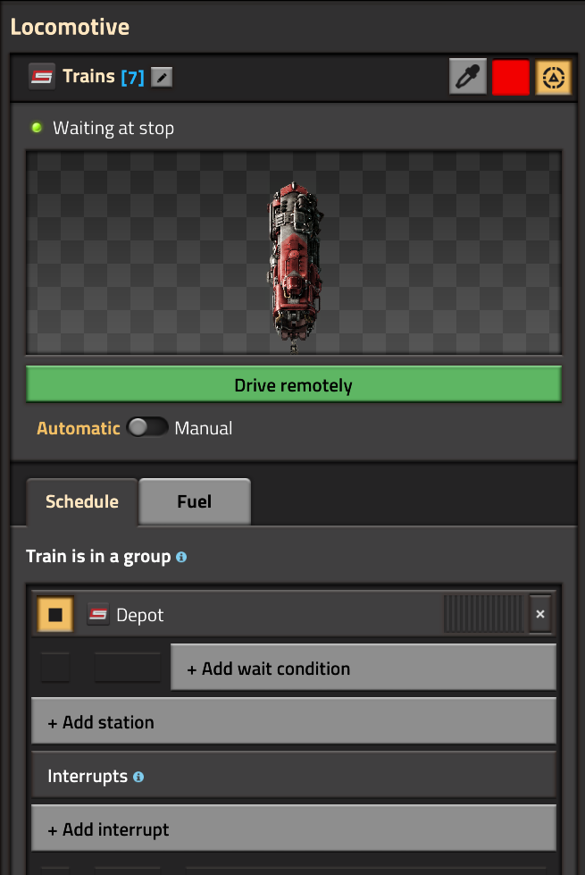

import BlueprintButton from '@site/src/components/BlueprintButton';

# Introduction

Cybersyn 2 is a Factorio train logistics mod designed for versatility and
performance. It is similar in functionality to the famous Logistics Train Network
mod, but with a much broader scope.

Cybersyn 2 is the direct successor of Project Cybersyn, built and maintained
by the same community. It has been redesigned to take advantage of the new
train functionality available in Factorio 2.0.

## Getting Started

### Starter Blueprint

The Starter Blueprint gives a fully-worked example setup demonstrating the basic usage of CS2, including trains, depots, refueling, requesters, and providers. The blueprint must be pasted using the Factorio map editor (for infinity chests).

Learning from this blueprint is the fastest way to get started with CS2.

<BlueprintButton
  label="Copy Starter Blueprint"
  blueprintString="0eNrtXX9v47aW/SqC/9oFnIH4WxrsA17Rl7codl+nOzPFYtEOAsWWE6GO5JXlpNlivvuSlGwrCTm+R53ZCbLTFnVoS0eX95IUL3l47x+zy/Wu3LRV3c1e/zGrFk29nb3+5Y/Ztrqqi7X7rrvflLPXs9uq7Xb2m/msLm7cF4v7y7Ld3td89nE+q+pl+fvsNfv4YT4r667qqrLH8YX7i3p3Y6+2Fxxv37W35fKsLar1WWFRN83W3tXU7pEW6czw+ezefSoLv6zactH/yvjH+RNYfoDddhbx6rrzwAFYnYdhZQBV0FENHVXSURUdVdFRBR1V01EZHdWQURVgrYyOClgrp6MC1mIpHRYwF2N0WMBejN69JGAwRu9fErAYo3cwiZiM3sMkYjJ6F5OIyeh9TCAmo3cygZiM3ssEYDJO72UCMBmn9zIBmIzTexkHTMbpvYwDJuOS/CZ3l4ZgdQhWBWEvQxOEvbSCMkHQZFyWh3GD4hoybDY0BZ0/hA1Km9GlVQfYEFBOtlI29AAtT8snUjIsO8KGgOhd6SAfCwLROw/7NJCAJVJB1QsJSxQBOnYJr+VhZh6QR74aGoPSr1QQSuOVM0Egg1cuDJThEoWrluMSBYFkSlQ3Ywd1q1ePhrYsBIy3dSWCEuJtPQIk4NFBcUJFJV7RYF+UCh5mHsvH0hCuxhUYFtDANZXBPi4zWKIIUI5LFOyYKoXfbBboZNtQDH6zPYYNmlThfSJSb3z8l8FxRB17wU25rHY3Z+XaVqGtFmebZl2G5veH8dv9FcRUKKbQJzE1dbxTD6AINsFfEhFVZvCQ/FTEYGuc0FuCI6mmvjRMfpBQPFFicAWGwRNiKSi44w5TluuzxXW57UKtUj+QOAR17DJVvS3bzn75SRz+xDbz2apa2/v6NcP9YuKx5s1mU7ZnTeua+H/virV9vP26btobr+VFc7Mp2qJrrDSzv8zcIuRuW14cMLt2V4YEl1QdqJM6UCQdqOenA03VgTypA0PSgXx+OsioOhAndZCTdCCenQ5MStUBP6UDw0g64M9PB+QxkZ3UAW1MZM9PB9QxUeQndUAaE0c4z0YH1DFRZCd1QBoTRzjPRgfUMVGYkzogjYkjnOeig4w6JoqTc6SMNCaK5zdHyqhjojg5R8pIY6J4fnOkjDwmnpwjZbQx8fnNkbLjmListpt1cX+2KeoyuI3weDTryt87e9/762qb2P+21c1mXSY3u3VXJVVX3iRvz//j5/N378/fvkp+rX+tu+syaer1fdJdV/VVsqxWq7K18iS97OUy6Zqkv6jcJpflurlzuN110Vm8pC3/e2ft0z/APck9Y/sq+aF2NzXtffKDg9qtl8lqVzvJPdjW1i4p9ngDiFVJcrnrnCTbpPy98JJfF7f2yuXSCjKoLVk1bbLdlItqVS365yXbJrlvdsmiqO2fbTd82+w6V8W66cpe4Mumu058g7K3lPZ/toJWurq2Bu9ruu0KL6St/WVVO8u5bzdtc1stLYi1V1LVt1Y/rmq3xdqWm1Vfpf5OayNH7HD22Tup+9oNTdkaqVjfFffbi+11cxdvBAbeRXnsjAZ37iesfgXd8GyCPx9c2MtTmKdigU573TmDiSqPcYOwHGaqkGAFTFUhwUqYq0KCVTBZhQSrYbYKCdbAdBUSbAbzVUiwOcxXocCyNIUJKzRcBjNWaLgcpqzQcAXMWaHhSpi0QsNVMGuFhqth2goN18C8FRpuBhNXaLg5zFwh4QK8M4HYDSCeccRuAPOMI3ZjAmav0HDxTf/wBIQBdLP9VEbkYSSNLc+7BZmPJ5yMqm3qz+5isAekNdqehFs5CdeaumckzaOKn6ISMZZja/1fT6EjAhxpRf4rSsrgbYio6TmHt3XiWAJbz/+KGpTYqvtXlFTBWw1x+2h46yaOZbA1+6+owQzeqIjXOsdWqL9erUWK7Sd8RUkZvIEQtY/g8IZMHEtgq9BfUYMS2zP4ipIqeJMgbh8Nb7rEsQy20vwVNZhh+wJfUdIc3giI2kem8MZKHGu8/F9vu6Luzo6rxUHn7pEy7W1d26wvLsvr4rZyevljtu2nwduHfz/Q9uezgfti5w4hntlZq6vjAMenbmw8BPxg/w2rjj890Php3fHsUw5DWJXLclEty/bC/rasDkodl37542kFVlW77S56z+WiLru7pv3N39iWy9nrVbHelvPZVVuW9VCywlhDWVToJqeWr/Zs2/WaXbfZdU4H1kbzWVdc+Xv+Wg3m+WsdN85f/bHVm2bZ96P9dkfTOm1v2uqmaO/3krgrvGhn3x0u6UU+cdFq7UWyL89Nf9bUPt4a/NY1pP7R6YPvuuqmtJXyfWGQaY/hKGdtaQe529Iqat24aqejrxbFplj4hm2/3W6q9bq5de00jbTe4wvdLRLUZ9uu2XxicUQ8OnwiDwJahB+/+8d58rc35+9+fJ/847v378/fWqSborZd7cKjby/W1U3Vhc+EsBHt+9MeN1eoxy0VvKwSWQyRGj5MIXRs1MXZ38KEkbLpXGE3FQiD5tPJwlHQES2cCDoaLmOKVAw3b1iRAA38YJKITAKXKYKEH4cQIow0oRtEkDR88kMQTn4wNaFLhNc/VQaf/RCUsx9M4QeFIiLqFK4sD49KGu8AMSS8A/BwVxqxuk+MlIe5JNdPhnMVhJbw2RJOOFvCtJo+OPHYiKc1fGKFU06sMI0fj4iZCj9ExyOVxTtHBMlM6BzhscrgJyA45QQEG9F96ZQm/ilKU1OXQULTDz0pyQq0TXiyaNZNu3Ucnf/84e35a3fBT/1MNbmzlyT/5BhOl/fJslwVu3X3z3s20HZPE7qruusAK+iV4zXd2SnjgRv0/bukqldNct3cJTe7xbUTtVi3ZbG8tz9YiKYtrspXToJ3+4nwIIOfpT+Qwt5rneTlmHvkwYtLO9c9kK7Ojg+zFSzqXh93pac13VnH1D3YcZOGulg0R6dyIvzdEZucQoeq/ermpovf9tC/zhI3ifbqLjtHr7Iz0s7WxT3IuVr1lUNbFOvFbl105ajWnnl1NzzffnpOlmdrDXqwj9m+SrpdW3sUx8vyz2pWq16ja/tEx+ZyT7Z37Oqq2776bLwqZgRMrOKCEgWCOidnh6kfF6TDXczgk5FYB9fw8a6nQgZfCAafjvDwu95kMCGMM9IglMOMME7Zic5SmBJGw2UwJ4yGy2FSGA1XwKwwGq6EaWE0XAXzwmi4GiaG0XANzAyj4WYwM4yGm8PMMBJunsLMMBoug5lhNFwOM8NouAJmhtFwJcwMo+EqmBlGw9UwM4yGa2BmGA03g5lhNNwcZoZRcDnAHOUGwWUwM4yGiwcoCE9FeIpHKGDh4ECpxJhhLA/7yDxVMHGLZTEsDRO3GG0ZmafgAeV4fTOMARYHymHaU1RxLIVpT3Es8AhvtIIjAieJPxUHEjBpKF47CZOG4lgKIw3FK6hhTk9cKIMxZeJCZRg5KA6Uw4yYaO14CjNi4lgM45lEK8g5Rq2JAwmYTxKvnYT5JHEshbE04hXUGDElDmRgNka8dhnMxohj5ZPZGOxZsjFi5Aku/sRuYFR9I/IczMhg3xgZX5iR4c3zjZERY2TwEV2TxMhgn4eRwYKyCJiRQZ1KT4huGXFCBH7QhZkwkp7OomAmNhqZ6SyKOCh+4DlWZ/zEMwvLJFNcpggSgzk2jEc0JfH9bCbCSDihI4aEEzpY2JWXf2LDmqUxleHRLWPi4dsn4T4+IbxlBAiPZ5yd3ifiCt+sDndHxWDWSkbYbOMTwltGBJwQ3jgMNCG8cRhowkHHMJDGCSskvgpXeJRvQWl1eJRvQWosExhOQY1OIDiFB5IRvwkf5yLD3IjpRI1bmpJ2trme8KYIiyjhje2Usq/NNdxnIgJqlFpD2dPmI2YTmVjDvtFqvtFqPjOthusMpdVQtnJwkly49+EUufAwbeCkWhR6HDdwUi0CI4kbOKkWCRVOqkVChZNqkVDhpFokVDipFgkVTqpFQoWTalFQMzinFgkVTqlFQoUzapFQ4YRaJFQ4nxYJFU6nRUKFs2mRUOFkWiRUOJcWCRVOpUVBzeFMWiRUOJEWCRXOo0VChdNokVDhLFokVJiaG55Y5HC6oLCrlhuIZxJJVMHzDGWZqBhSjnJMJGlZXKRYwJ1ITUXKIH5JFIaj7BIVQxIotySKhIWpiVZNQbySKIxGWSXRehmUUxJFyiBGSbRqOconiQnEsLgrMYFonKID/yMKw1EmSbReAuWRRJGwaCXRqimIQxKF0SiDJFovg/JHokhYjI9o1XKIOxKDoTOITg2M5Lhl4tTAyPlU1oj8YpyRLxJyQ4wYTijBQ36jd3xZeoc3zjd6R4zeIUaMOgq9Q30xcofgCiV3EOewHN4/jgxoBqUBmNjQCJ9vDuca5flkgkgsoSrOgDu8dKOQ0zfLYgrEs+OGFYgnxw1ntMXZQxEcfB8skvQXbvMxIIMSFBghrobA0+SGuStC5ChBgVGiagicPRQREM+SG2YhCTxLbgwIbvRhrpYgB0g6EBQ8gew0QUFIhRIUGCGehpB68kjEYqObNCjpgRlSA4QpRjErwYw6FknbnaIEhQD5MlhXPF5STESYXRc+kyaUQIkEpNPxYsQyOsUkkOmgRf6AStCW9q5F2W/ut+XVbl20+03yovYJfNb9jz+8ffNjUq32SXs6ty2fVHW1qq1Iwy1Pt6YPtHrinrQY8Z3I5AhOYkcM9IGesOD24t30uq/bZkyE6K6L+jdPEfh1VuxGvINivR7YAJ67cNP4TET2IdWicLmI9g/YJjfF/Z56MSQwOpAv3COeqmlTbLfVbXm2h8A28oXS6EY+5VCmwDMUx9o//H4Ox8IQKkf38kmxbgRA5Ro28ynxRQQQuGrYzafBcnQ7nwYr0P18GqxEN/RpsArd0afBanRLnwZr0D19GmyGburTYHN0V58ECzB6JGAyw9B9fRosRzf2abAC3dmnwUp0a58Gq9C9fRqsRjf3abAG3d2nwWbo9j4NNkf390mwANGHAyYDmD4cMNmI6kPc4qfBwiTlyIwjk+gyHY9tYWTwcgyPAGEpi7iksKZFNqYhrCo3rT9NIfCVDe8xLKp2sau64x7DRVkXl+vDyvvH+eE5F9uy66r6alibv2luy4td3e+9lMsLz6Q9rNePt2SeHt4dtlhY6rgGwzp80Z2ty8JXZL+H4zZfQjqA0yJx4rJxhmVFItosxwgVVFQGtAT5MltCzgEdqBeqAyy7E7V1YRQXKqoC7MVfqL00oAPxQnWAZamitq4M0Cx7oZrNIZ4TTbOSRgk8kJWoqMAb7Ij9ouwlU+ANdrTaC9OBgJhn1NYlISIaFRV4gwn9Qu0FvMGOVnthOjAQF5DaujKIGkhFzQF7vUxPQT7g/57SgXqhOphOyoktl0g2PfUYj3M+vzEfpzEfvTmeGfORPR/mo2RYqjGuvlimMcngTGPERSzJ4JNTPNK34ZwGw4B56oXE4Jg84aQxkk3POcZ1bESbnnIsislhZlmkwhxmloVzLEnOUY4fJwQhkhxf0Y/IJ1GOH6cEIZIcXt4PJ86SOMM4BgR3hnA+NMkzlJonBImaJ3mOUvMEIXaQ/BORN0Uk1poU1LhtTEaVkAeBOcr5E5RAR1LAPSZifgHvgQkZUyLeSSJAeCeJABn0VSRovhFOSg5nbZQiR9mDwhBIT3JESiazB4WZxh78/s1PP52/Td68Pcc5hKNjVkRCnBzRpMkswodV+//HIpSSoyzCx+0s3MzwYSjcD/DAkuEstzLCB/9URKCc1KE0HBIopyjQwDGBSLAZHBSIBJvDUYEosEAMyn1YIBIsg+MCkWA5HBiIBCvgyEAkWAmHBiLBKjg2EAlWw8GBSLAGjg5Egs3g8EAk2ByOD0SBBXjQEjAZwIMWgMkAHrQATAbwoAVgMoAHLRCTKThKEAlWw2GCSLAGjhNEgs3gQEEkWDiUYWTGgccylGGX3jAsVhApYKo0fAL1T7LnsIXxIAbDn9vEMAIOe5TS1k2NxAIWEa2msGhKRFQ9gfz38tqCmUD/e3layLAwUsQWlmMxrmioWTqBAPjiLJaxCRTAl6cFjsUII7YwMYEE+PJ0K7FwZ0TdKiz6GRFVT6ABvjyLmQlEwJenhQwLQkdsYTkWk46GmqcTqIAvzmLIMZSj3V6cFjgWGpDYwgQWKZCIKifQAV+exdQEQuDL08L06DgyktRGjg53wKER02+UwM9NCXTm+EYJjFICR4eGKJRAyb4cJZAc0ZsrbGlLpTD/LLyyqVKYfyZFGIhPZu7JCPdHjc6RoMy9OCYc5S9WYZhTIyMSwZyaGBBMPJMmDJShXEKpT89TVAqv60fkG3H/iVzCx/IFqVuK4Z0hDwvIp7+FI4nFFYMJHTHhYEKHCo8dTKHNRKWEZsI0Sk5UjAILx/h7DBtpNHCMv5g64SiYj9UZFpDDu2AqPOJxcgrdPW9NPeWjyiAyHBYzJiIcFlOFextAV94DSUIj5HBMTKUosHDKREWzCz1n4jHYvhwT+r5brx1zrrtutmXST5l8dkA7s+76H8pka5+QvH/73Q8/Jv/69s3PP7l0f/b7+2R77S7dWi9uuVuXnttY1dZ52m26rafxvXeAyWW5buqrISXgVdvsNtvk7rpaXCdOdp9isN1nUvzltmo7O30bGu9fDnPoD16swVFZ90kZv3/H/UN9VsDLMnE6KDonTrJq2mRZris7E63KkTBbn+EwKX8vPIFxL67PJehTDXqsbWlRbRVvnMRtudpZJCv+Ps3j3XVZJ+vmLrF/u9+SYmVhEudsbq/dhcOT75+SEdeN9QUaO+kmszbViGZ+krWpgkZ+763r9Pe385/evH/3arC3++a2qG2Ni2PdnBXqJunbXp+1siuvWv/rPLncdUlZWNP5tpLUZbm0DSax7rGddlvJn+AVy2Wfp7KyJj40FVu2rkdSbK2qNk33KhmM47Xfli75Y3JtnfNBs3t9Opasla0u70ZfWdjrhYe1jaJcNZ5malvnshmpv7vfOAUOrWt2HIV6x8k2x648cw4P3Sw5ygt93KeDXVqk8GuQEv5VCTj8a2TkFRx+DUqSgPirITz7pPPyD69BQ3sNCpghqwwJF2bIKkNpSjBDlgYLM2RpsDBDlgQrYYYsDRZmyNJgYYYsDRZmyNJgYYYsDRZmyNJgYYYsDRZmyNJgYYYsDXb01iraq+bsrrjyy49PV3+OoP3C+sW6uaq2XbXYXtjXpS3fNC7P82GRtLEzrXq/NJe+clPpqr61XzV2IvS63q3XIYEABrsE2hDAYJdAGwIY7AJoQ+NI6J+0ijD/R1aRKIeYVk+FcohpsBrlENNgDcohpsEee/bIGwhgpp/B1v5wlN/OcN/kMnf/ZFlq8tSwVMqcs8wxJq/86v2l/3/RZzQftsVciq/lOK16s/it7M6c3zM7XuXygF2MGpZPDHYo9ZsKi9/8X8MGmj/4GryGH67xCcHsfyEt5igTm2QcgOrPgYavGcrEpsHi6zLhObPGJ9/hxUuNr8sQjrkrja/L5BRYfF2GcuRNaerpWXlIN5nRNpZ0Nnnl2j8iiJlj6cnyT+zI+QUGJCWZMim6CUfVlWGwh044/qAMfDD9SaMJOsAG3kCI9EEDh3JQGUlAhTrWmtEca6NRx1ozEq5BHWvNKC0gQx1rGmyOOtYkWCDy+eBY02AZ6ljTYDnqWNNgBepY02Al6ljTYBXqWNNgNepY02AN6ljTYDPUsabB5qhjTYIdkVNJjrUH/ZIuXM5Qx5pWT4461jRYgTrWNFiJOdZf3ioKdaxp9dSoY02DNahjTYPNUMeaBptDjvWfs/Vzc6wpTrNO4SQoFMXrFE6CQoOFk6DQYAXqompCtlWdStRF1YICq1AXVVNyu+lUoy6q5iS3S49obhR38rG4f86d1GmGupPkesEbvpqQk0czeMNXU+KcacZQL1BzEi6HvUBF8gI1E7AXSMOVsBeoKIZTsBdIgtWwF0iCNbAXSILNYC+QBJvDXiAFFqDaKcBkQJBQBZgMYN0pwGQAB08BJuMS9gJJsAr2AkmwGvYCSbAG9ALVl/U3NM9gL5BUzxz2AimwIoW9QBIsA73AL20VAYdootUTDtFEg4VDNNFg4RBNNFiNeYHqZW6v9pO36a4iQB7jSFfMYFeRBJvDriIFVqawT2cIPp1ksE9H4RFqyWGfTtN8HykmbzvqSIx2PWKPkfxE81n9RKlgP5GqKzjtvDaUtgifj3nSaIL+nMxgfy6n+XMSTkuvKbvrWsFp6TVhX1crOC09DRZOS0+DhdPS02DhtPQ0WDgtPQ0WTktPg4XT0tNg4bT0NFg4LT0JVsNp6WmwcFp6Giyclp4GK0B/Lv/CngMQLlUCbQgIlyqRNqRhf44Ea0B/7otbJYP9OVI9c9ifo8ACYVcF0IYMg/05EizH/Ln8mz8XVKOA/TmSdSTsz5FgFezPkWBhvqeh8My0gfmehhZIRBssWophn9VJMnCAFGq9shR1kgxlbzdjqMthSLulACttcDkMZe8PYKUNLgcNVqIuBw1WoS4HDVajLgcN1qAuBw02Q10OGmyOuhwk2DxFXQ4aLENdDhosR10OGqxAXQ4arERdDhqsQmf4NFiNzvBpsAad4dNg4Qk1DRaeUFNgTQpPqGmw8ISaBsvRmSANVqAzQRqsRGeCNFgFz9ho2WANkqyd7+MKm54i87kCVo6djoNzoKcErDQjNhe68m8i6Q4NLev6UTmkzIImxY4xmU/lGn57/vefz/89Hk4wNFs2DD7JRG1TDEjcxx9iP0rc1wezaec+HEsRjf7yMOzLEJ6lj87SJye0JvNhfnxIn2YIk1PufJicPmaLz95XdpFwOCfisezdZUokFjNipJ3UzqFNTczY+PbN9/92/j5xrQNP2fhoLYBWuek7b1kkxqIZEeKomPIkpkIx2Wk5j0PpAaysy/bq/sy3wJW1WXz7K3NhZy53q5WLmVr9T9nH7B3+cUFc99GI+qHzuLjkyu6UtiOUOzqBNnx0dT8kL5p22d/32L92yD7Ilf0mHs3qH/81jqjlh+F9lxoP5P04lPzw4/vztz//9N4P5g8C8A79qLzZdPf+VxcTt7wYvrZtd+YUOxRdw/Mvjwv/Srgo6sg9o8e46o4D68abs73F6qJfhpo/jM77L7OPIzG2m3JRrarFxdJ2ExcW1wWbrZvuYrVbr2MCBcZmp+muaK/K7rElRsP3XTGOEf1AaV4d8WeOJD4Gyo2J11ULFzaYZW4F7oMz57ZalhcHq+6DB3/w4YPtm2nxm5Oq7sf9vfyNW87z5xgui/5PP3kZfvDUlv4HLdj4B7eWMfzgNn1HULanr9rGn7cfw6YPLkpHFz18IDv8Mn44Hz/Dc94OFz0QS49+GYsoHlwkjhc9FN7tlw0CK/Hgh+Mt44tkPr7IeYiHi4TTuksP6zT9i5JzNWfS9vAP875gfWr/t/I/5L6g+ZzNtZwz97d0f+v+b+3+zvq/7cfcpP5v9zG31fR/u3tNf6/7mJv+XvcxN/297mOe9fe6j3nW3+s+5ll/r/uwAvG5sAXGjCvx/jLGWaCkh5IKlLKh5J7LxHCfYIHScJ9QT0syHUp5oDTIaR1I7kvSl7KRUv3nnKm0L7nPOdO99v3nnIv+N56653HWP4GneaDUK4nbd+TTkh5KTuOcD/exPFAa7uMiUMqGknlasroSvpTb2rqSq62Xfs5lX6OhZF3UvqTHJelrq1lfcp9zIYZS7mwkrEvlnidSHiiZoaQDpXwoufoJNtzHeKA03Oe19KjkWpQrOW09KQlfd2FbH/cl6Uu5r0NvP/95qJH/nAup+5L7nEs2/JY5fYq8b4MiZ4GSHkoqUMqGktOZTPv7ZMoCJT2U1NPS0LKk19njUt+uvbxzOdRvKLF8KGXjkq+7C/bvS340cMnTPKYfAx6Vsl670o8Dj0tiKAlfGu7L9NNSPtyXp4GSGkoyUDJ9/Zy8cxccWR1LttX5kdFqclRivqSHEdR9zh1HzA+b7nPu/EblB0XjSqz/zX/O3fyzL0lfcn3lQ781Zt+nl+tduWnti9O+VdfFpZ1bvJ65QJ/v+pTj78pu57w6609s/cteae726VQmtbH/+/jxfwHQ576E"
/>

### Add a Train

Create a train stop which will serve as the *depot* for your newly created train.
Build a train at the stop and add it to a train group beginning with the  virtual signal. Give
the train group a schedule with only the depot on it and set the train to Automatic.
Your schedule should look like this:

You've now added a train to Cybersyn. You may add further trains by simply assigning
them to the same group.

:::note
See [the Trains documentation](./basics/trains.md) for more information on
configuring Cybersyn trains, including refueling.
:::

### Provider

TODO

### Requester

TODO

## What's new in CS2

For those coming from CS1, this is some of what's new in CS2. This is an incomplete list.

### Logistics

- **Automatic Thresholds**: in CS2, there is virtually no need to set or worry about thresholds unless you suffer from OCD. Thresholds are computed algorithmically using true inventories and request values. Just build a station, set your requests, and roll with the vibes.

- **Orders**: in CS2, a station can have multiple orders offering or requesting different subsets of inventory to different networks. This allows many more logistics scenarios to be modeled using fewer stations.

- **Quality Spread**: in CS2 it is possible to request a given number of items spread over a given range of qualities, i.e. "Give me 5000 total iron ore with quality at least rare."

- **OR orders**: It is further possible to request a total number item stacks with the composition of the items being an OR over any set/mask of given items.

- **All Items orders**: It is further possible to order a given number of stacks of any item whatsoever. This can be useful to create "pull", "sink", or "dump" type stations that will always pull anything offered on a given network.

- **Correct global priority**: unlike CS1, where priorities are compared only between deliveries of the same item, CS2's priorities operate globally per-order. (This means, for example, that your nuclear power plants set to priority 100 won't die because your fluid trains are tied up transporting oil at priority 0)

- **AND network matching**: Requesters can be set so that a provider must share ALL networks (Rather than just one) in order to match. This opens up additional logistical solutions for some of the rarer edge cases encountered in advanced modpacks like Py.

- **Topologies**: Topologies are isolated collections of stations and trains that get their own separate dispatch thread.

### Trains, Loading, and Unloading

- **Better Auto Allow List**: CS2's auto allow list works more correctly in more situations, and has visual indicators to find issues in how it is being computed.

- **Manual Allow List**: For modded wagons and other situations where the auto allow list does not meet your needs, CS2 has a manual allow list where you can specify exactly which trains you want to arrive.

- **Spillover**: CS2 can compensate for imprecise loading by charging additional amounts against the providing station's inventory. This fixes a common CS1 issue by preventing a second train from getting stuck if a first train gets slightly overloaded due to extra inserter swings.

- **Live Wagon Reader**: For multi-wagon trains, CS2 provides a builtin UPS efficient wagon reader for cargo wagons (implemented using a proxy inventory) that can be used to help precisely load individual wagons.

- **Circuit and Timeout Controls**: CS2 provides a full array of manual circuit controls and timeout controls for deciding when trains depart a station.

### Efficiency

- **Removal of loop scaling bottlenecks**: CS2 can dispatch as many trains as needed per loop cycle and is not limited by a single train per item. Therefore the phenomenon of "dispatch loop starvation" does not exist any longer in CS2. (This completely fixes the most common performance issue that is constantly reported on our Discord.)

- **Cooperative multitasking**: CS2 runs on a custom thread library that controls its work per frame. It can manage an entire megabase while still staying under its defined global work cap.

- **Circuit change detection**: CS2 detects when inventory and order input changes and only polls stations that need it. This allows it to skip a lot of expensive operations that CS1 cannot.

- **Queueing system**: CS2 can queue trains beyond ordinary train limits, allowing it to route more of its traffic outside the dispatch loop. This results in VASTLY increased train usage uptime and correspondingly fewer trains needed for a given workload.

- **Removal of depots and refueling**: CS2 does not manage depots or refueling, instead leaving these to vanilla Factorio mechanisms. Regular stations are used as depots and standard interrupts are used to refuel.
